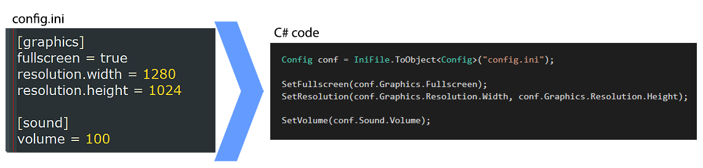

# SINI

SINI (Simple INI) is an ini files wrapper lib with easy-to-use methods to parse C# primitives as well as enums and custom objects. 
It also provides an API to convert an ini file into an object instance, similar to how C# allow to read XMLs as objects. 

SINI support comments and sections, and is highly configurable.



# Install

`Install-Package Sini`

Or visit [https://www.nuget.org/packages/sini/](https://www.nuget.org/packages/sini/) for more details.

# Usage

Using SINI to deserialize objects from INI files is quite simple:

```cs
MyObj obj1 = IniFile.ToObject<MyObj>("my_ini_file.ini");
```

Or you can read individual keys as different value types:

```cs
// open ini file named 'my_conf_file.ini'.
var ini = new Sini.IniFile("my_conf_file.ini");

// read values as string, int, bool and enum
var someVal = ini.GetStr(null, "some_key", "default value if not found");
var intVal = ini.GetInt("section1", "int_key", 0);
var boolVal = ini.GetBool("section1", "bool_key", false);
var enumVal = ini.GetEnum("section1", "enum_key", MyEnum.Foo);
```

And a valid ini file to match the last example above would be something like:

```ini
; in global section
some_key = hello world

[section1]
int_key = 5
bool_key = true
enum_key = Bar  ; possible values = Foo / Bar
```

## Reading Primitives

SINI has convenient methods to read the following primitive types:

- GetStr()
- GetChar()
- GetByte()
- GetShort()
- GetUShort()
- GetInt()
- GetUInt()
- GetLong()
- GetULong()
- GetFloat()
- GetDouble()
- GetBool()
- GetEnum()

If you need a built-in C# type that doesn't have a wrapper, you can use `GetPrimitive<T>()` instead. For example, lets try with short:

```cs
short value = GetPrimitive<short>("section", "some_key", -1);
```

In addition, it has useful methods to get all sections, keys, check if a given key or section exist, convert to dictionary, and much more.

### Exceptions

If you try to read a wrong format, for example you try to read int but value is not a valid number, a `FormatException` exception will be thrown. This exception is used by any Get*() method that can fail on parsing.


## Reading Custom Types

Lets say you have a custom type and you want to be able to read it from ini files as if it was a primitive type. For example, a point struct:

```cs
public struct MyPoint
{
    public int X;
    public int Y;
}
```

To do so, you can register a custom parser method:

```cs
// register cusom type parser for MyPoint
IniFile.DefaultConfig.CustomParsers[typeof(MyPoint)] = (string val) => 
{
    var parts = val.Split(',');
    return new MyPoint() { X = int.Parse(parts[0]), Y = int.Parse(parts[1]) };
};
```

And later you can use it like this:

```cs
MyPoint point = ini.GetCustomType("section1", "point_value", new MyPoint());
```

Note that if you get an exception inside your parser method, SINI will capture it and raise a `FormatException` instead, which is the exception you get on any invalid format.


## INI to Object

C# have a wonderful functionality to convert XML files into object instances. If you didn't know about it, [check it out](https://docs.microsoft.com/en-us/dotnet/api/system.xml.serialization.xmlserializer?view=netcore-3.1) now - it's extremely useful.

SINI provides a similar functionality, but with INI files instead. For example, lets say you have the following object:

```cs
public class MyObj
{
    public int Foo;
    public string Bar;
}
```

You can write a corresponding ini file for it that looks like this:

```ini
foo = 5
bar = hello
```

And then read it directly into an instance, with the `IniFile.ToObject()` method:

```cs
MyObj obj1 = IniFile.ToObject<MyObj>("my_ini_file.ini");
```

When using ToObject(), SINI will attempt to read any Field and Property with public setters from the ini file (using reflection).
Note that the name of the fields turns into *snake_case* while in the ini file. You can control this behavior, but more on that later.

### Nesting

Sometimes you have nested objects in your class, for example if your class looks like this:

```cs
public class MyObj
{
    public int Foo;
    public string Bar;
    public MyObjNested Nested;
}

public class MyObjNested
{
    public bool FooBar;
}
```

In this case, when you try to read an ini file into the object, the nested object will attempt to read itself from a section with the same name (but in snake case). So in this case, your ini file should look something like this:

```ini
foo = 5
bar = hello

[nested]
foo_bar = true
```

#### Deeper Nesting

What happens when your nested object contains another nested object? After we use the section name for the first level nesting, following levels of nesting will use a decimal point prefix in keys.

Let's take a look at a more realistic example to illustrate that. Consider the following configuration object:

```cs
class Config
{
    public GraphicsConfig Graphics;
    public SoundConfig Sound;
}

class GraphicsConfig
{
    public bool Fullscreen;  
    public class ResolutionConfig
    {
        public int Width;
        public int Height;
    }
    public ResolutionConfig Resolution;
}

class SoundConfig
{
    public int Volume;
}
```

The corresponding ini file for it would look like this:

```ini
[graphics]
fullscreen = true
resolution.width = 1280
resolution.height = 1024

[sound]
volume = 100
```

As you can see in the example above, `Graphics` is nested and have another nested object in it, `Resolution`, so for the values under `Resolution` we use decimal point for keys prefix. 

### Dictionary<string,string> Field

When parsing an object that has a `Dictionary<string, string>` member, it will read the section into this member as-is, meaning that the dictionary will be filled with the keys and values from the section corresponding to the field's name. 

For example if we have the following object:

```cs
public class MyObj
{
    public int Foo;
    public string Bar;
    public Dictionary<string,string> Nested;
}
```

and we parse this ini file into it:

```ini
foo = 5
bar = hello

[nested]
foo_bar = true
second_val = 123
```

The result of `Nested` field will be a dictionary with values: `{"foo_bar": "true", "second_val": "123"}`.

### Custom Parsers

If you defined any custom type parsers prior to calling `ToObject()`, for example like with `MyPoint` [in the example above](#reading-custom-types), they will be used when attempting to read this type instead of the default behavior (which is calling `ToObject()` internally on a section with the same name).

### Multiple Objects in a single file

The `ToObject` methods accept an optional `section` parameter. 
Providing it will only read data from the given section, and treat it as the global scope. You can use this to store multiple objects in a single file, separated by sections.

For example, we can create this ini file:

```ini
[obj1]
foo = bar
hello = world

[obj2]
foo = rab
hello = bye
```

And then read two objects from it:

```cs
public class MyObj
{
    public string Foo;
    public string Hello;
}

MyObj obj1 = IniFile.ToObject<MyObj>("my_ini_file.ini", section:"obj1");
MyObj obj2 = IniFile.ToObject<MyObj>("my_ini_file.ini", section:"obj2");
```

Needless to say, in this case we can't have any nested fields, since we already begin in a section.

### ToObject Flags

You may have noticed that the `ToObject()` method also accepts an optional `flags` parameter. These flags determine the behavior while loading the ini file into an object. Let's list them here:

#### AllowMissingFields

If set, SINI wouldn't mind if not all public properties are loaded from ini file.
If not set, you'll get an exception unless the ini file populates all public fields.

#### AllowAdditionalKeys

If set, SINI wouldn't mind if there are extra keys in the ini file that don't match any of the object's fields.
If not set, you'll get an exception for any unused key.

Note that this validation only runs if you read the whole file, and not just a specific section in it.

#### LowercaseKeysAndSections

If set, when searching for a field in the ini file its name will be lowercased.
For example, a field named 'Foo' will be taken from a key named 'foo', and 'FooBar' from 'foobar'. This also affect section names.

#### SnakecaseKeysAndSections

If set (default), when searching for a field in the ini file its name will be snake_cased.
For example, a field named 'Foo' will be taken from a key named 'foo', and 'FooBar' from 'foo_bar'. This also affect section names.


# Advanced Stuff

## Multiline Values

You can have string values that span on multiple lines. To do so, end the value with the backward slash character:

```ini
multiline_value = this is \
a multiline \
value.
```

This behavior is configurable, you can change the character used to indicate multiline value by setting ```IniFile.DefaultConfig.ContinueNextLineCharacter```, or you can disable multilines completely by setting it to '\0'.

Note that you can't have empty lines or comments after a multiline character, for example this is illegal:

```ini
; format error!
bad_multi = this is \

mutiline value.
```

This is also illegal:

```ini
; format error!
bad_multi_2 = this is \
; you can't have comment here!
mutiline value.
```

This is fine though:

```ini
; the line with just the \ will be empty line in the multiline value
ok_multiline = this is \
\
multiline value.
```

## Booleans

By default, the following values will be considered as 'true' for boolean fields: ```1, true, yes, on```, while the following as false: ```0, false, no, off```. Any other value will throw `FormatException`. 

These values are defined by the ini files config, and you can change the accepted values. For example, lets add 'yeah' and 'nah' to the possible values:

```cs
IniFile.DefaultConfig.BoolPositiveValues.Add("yeah");
IniFile.DefaultConfig.BoolNegativeValues.Add("nah");
```

Note that before parsing booleans SINI will lowercase the value, meaning that 'TrUe' will be treated as 'true'. You can also modify this behavior if you don't want it:

```cs
IniFile.DefaultConfig.LowercaseBoolValues = false;
```

If you disable lowering case of booleans, values like these:

```ini
broken_val = True
```

Will raise `FormatException`, because `True` != `true`.

## Keys & Section validation

By default SINI will only accept English characters, underscore, digits and dots for sections and key names. For example, the following keys will throw an exception:

```
bad key1 = val
bad-key2 = val
badkêy = val
```

The keys / section validation is done by a `RegEx` match. You can use a different regex and change the naming rules by setting `IniFile.DefaultConfig.KeyValidationRegex`. For example, lets make it only accept English characters, no digits, underscore or dots:

```cs
IniFile.DefaultConfig.KeyValidationRegex = @"^[a-zA-Z]+$";
```

You can also set it to null, if you don't want any validations.

## Changing Delimiter

By default SINI will use '=' as delimiter between key and value. If you want to change that for whatever reason, you can set it in the ini config:

```cs
IniFile.DefaultConfig.Delimiter = '|';
```

The example above now expect ini file to look like this:

```ini
some_key | some_val
```

## Comments

By default SINI will use ';' and '#' as comments, but you can change these characters. For example, lets say we want to use '&' instead:

```cs
IniFile.DefaultConfig.CommentCharacters = new char[] { '&' };
```

In addition you can decide if you want to allow comments only at the begining of a line, or if you want to allow comments after the value part (default behavior). To disable comments after value, set `AllowCommentsAfterValue` to false:

```cs
IniFile.DefaultConfig.AllowCommentsAfterValue = false;
```

Once set to false, lines like these will not be accepted:

```ini
some_key = some_val ; this is broken
```

## Per-file Config

In the examples above we only used a static config instance, `IniFile.DefaultConfig`, which is used to determine the behavior of SINI when no specific config is provided. Note that you can provide custom configurations per ini file you open, as a constructor parameter. For example:

```cs
var customConf = IniConfig.CreateDefaults();
customConf.AllowCommentsAfterValue = false;           // <-- change something
var ini = new Sini.IniFile("ok_file.ini", customConf);      // <-- use custom configuration just for this file
```


# Changelog

## 1.0.1

First release.

## 1.0.2

- Added deeper level nesting with key prefixes (for ToObject() API).
- Added support in multiline values.
- Added more tests and rearranged code.

## 1.0.3

- Added 'Sections' to get all section names.
- Added 'GetKeys' to get all keys of a section.
- Added 'AsDictionary' to get a section as a string-string dictionary.
- Added 'ContainsSection' to check if a section name exists.

## 1.0.4

- Added option to parse `Dictionary<string, string>` as object member.
- Fixed `AsDictionary` to update accessed keys set.

## 1.0.5

- Added 'SetValue'.
- Added 'DeleteKey'.
- Added 'DeleteSection'.
- Added ability to create empty ini files.
- Added ability to save ini files.

# 1.0.6

- Fixed writing multiline values (was missing the \ before).
- Added NewLine setting to control how we break lines.
- Added comments support.
- Refactored the way we write INI files to make them clearer and prettier.
- Added more tests.

# 1.0.7

- Added methods to generate INI file from object.

# 1.0.8

- Upgraded to .net 6.

# 1.0.9

- Better handling properties with only getter or only setter when converting to objects and back.
- Added option to register custom serializers for converting object to ini file.

# 1.1.0

- Added some tests.
- Fixed some comments.
- Removed `CreateDefaults()` from ini config. Just create an empty instance instead.
- Renamed the config key for multiline to `MultilineContinuation` and turned it into a string to support multiple characters.

# 1.1.1

- Updates .net version to 7.
- Fixed bug when converting ini to objects with booleans that are not 'true' or 'false'.
- Removed useless old folder from git.

# License

SINI is distributed with the permissive MIT license.
